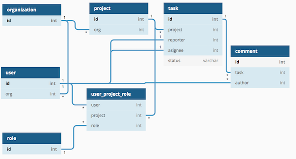
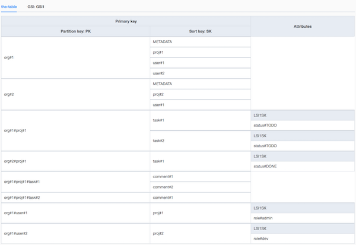

## task 10

## goal

Design and deploy somewhat complex single dynamodb table design. Use [dynamodb-toolbox](https://github.com/jeremydaly/dynamodb-toolbox).

Entity relation diagram

<!--
// https://dbdiagram.io/d

Table organization as O {
  id int [pk]
}
Table project as P {
  id int [pk]
  org int [ref: > O.id]
}
Table user as U {
  id int [pk]
  org int [ref: > O.id]
}
Table role as R {
  id int [pk]
}
Table user_project_role {
  user int [ref: > U.id]
  project int [ref: > P.id]
  role int [ref: > R.id]
}
Table task as T {
  id int [pk]
  project int [ref: > P.id]
  reporter int [ref: - U.id]
  asignee int [ref: - U.id]
  status varchar
}
Table comment as T {
  id int [pk]
  task int [ref: > T.id]
  author int [ref: > U.id]
}
 -->

Access patterns:

|             access pattern             | method | index |         PK          |          SK          |    filter     |
| :------------------------------------: | :----: | :---: | :-----------------: | :------------------: | :-----------: |
|       list users in organization       | query  |   -   |        OrgId        | begins_with('user#') |       -       |
|     list projects in organization      | query  |   -   |        OrgId        | begins_with('proj#') |       -       |
|   get user role in specific project    |  get   |   -   |    OrdId+UserId     |       proj#id        |       -       |
| list users in project and their roles  | query  |   -   |    OrdId+projId     | begins_with('user#') |       -       |
|         list tasks in project          | query  |   -   |    OrdId+projId     | begins_with('task#') |       -       |
| list tasks in project in given status  | query  |  LS1  |    OrdId+projId     |     status#name      |       -       |
| list tasks in project assigned to user | query  |   -   |    OrdId+projId     | begins_with('task#') | assignee = id |
|           get specific task            |  get   |   -   |    OrdId+projId     |       task#id        |       -       |
|     list comments of specific task     | query  |   -   | OrdId+projId+taskId | begins_with('comm#') |       -       |

## services

-   _DynamoDB_
