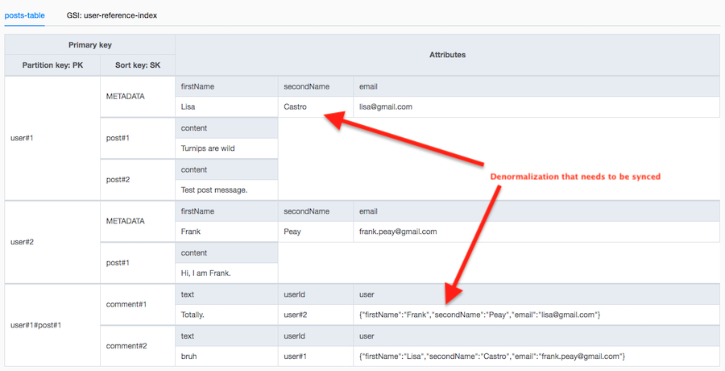
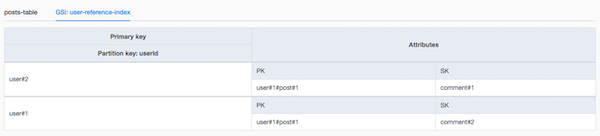

# task 11

## goal

Deploy simple rest api performing CRUD operations + use Dynamo Streams for managing updates to denormalized structure.

Proposed approach: using GSI for keeping items which depend on the user data.

Alternatives:

-   normalizing the data (_duh_)
-   instead of an extra index, manually create items for each reference (pros: can handle items which reference multiple
    users)
-   ??? (let me know)

## services

-   _DynamoDB_
-   _DynamoDB Streams_
-   _Api Gateway_
-   _AWS Lambda_
