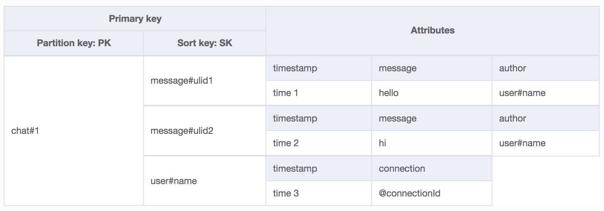

# task 15

## goal

Implement multi-room websocket chat.

## services

-   _API Gateway v2_
-   _AWS Lambda_
-   _DynamoDB_

## stuff



```
docker run --rm -p '8000:8000' amazon/dynamodb-local -jar DynamoDBLocal.jar -sharedDb -dbPath .
aws dynamodb create-table --cli-input-json file://table.json --endpoint-url http://localhost:8000
```
